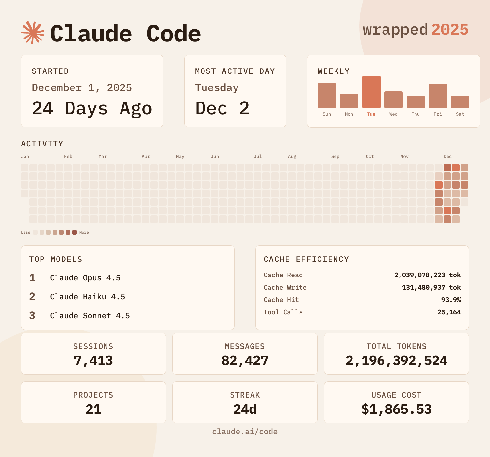

<div align="center">

# cc-wrapped

**Your year in code, beautifully visualized.**

<p>
  <strong>Credit:</strong> Built on top of
  <a href="https://github.com/moddi3/opencode-wrapped">opencode-wrapped</a>
  by moddi3 (<a href="https://x.com/moddi3io">@moddi3io</a>).
</p>
<p>
  Found this useful? Follow <a href="https://x.com/nummanali">@nummanali</a> for more AI tooling!
</p>

Generate a personalized "Spotify Wrapped"-style summary of your [Claude Code](https://claude.ai) usage.

[](LICENSE)
[](https://bun.sh)



</div>

---

## Installation

### Quick Start

Run directly without installing:

```bash
npx cc-wrapped # or bunx, or yarn/pnpm dlx
```

### Global Install

```bash
npm install -g cc-wrapped # or bun/yarn/pnpm
```

Then run anywhere:

```bash
cc-wrapped
```

## Usage Options

| Option          | Description                                      |
| --------------- | ------------------------------------------------ |
| `--year, -y`    | Generate wrapped for a specific year             |
| `--month, -m`   | Generate wrapped for a specific month (1-12)     |
| `--all, -a`     | Generate all 12 monthly wraps + yearly summary   |
| `--help, -h`    | Show help message                                |
| `--version, -v` | Show version number                              |

### Examples

```bash
# Generate yearly wrapped (default)
cc-wrapped

# Generate wrapped for a specific year
cc-wrapped --year 2025

# Generate wrapped for a specific month
cc-wrapped --month 12           # December of current year
cc-wrapped -m 6 --year 2025     # June 2025

# Generate ALL monthly + yearly wrapped images (13 total)
cc-wrapped --all                # All months + yearly for current year
cc-wrapped --all --year 2025    # All months + yearly for 2025
```

## Features

- Sessions, messages, tokens, projects, and streaks
- GitHub-style activity heatmap
- **Monthly activity bar chart** showing usage across all 12 months
- **Generate monthly or yearly summaries** — view stats for any specific month
- **Batch generation** — create all 12 monthly images + yearly in one command
- Top models and providers breakdown
- Usage cost (when available)
- Shareable PNG image
- Inline image display (Ghostty, Kitty, iTerm2, WezTerm, Konsole)
- Auto-copy to clipboard

## Terminal Support

The wrapped image displays natively in terminals that support inline images:

| Terminal                                   | Protocol       | Status                      |
| ------------------------------------------ | -------------- | --------------------------- |
| [Ghostty](https://ghostty.org)             | Kitty Graphics | Full support                |
| [Kitty](https://sw.kovidgoyal.net/kitty/)  | Kitty Graphics | Full support                |
| [WezTerm](https://wezfurlong.org/wezterm/) | Kitty + iTerm2 | Full support                |
| [iTerm2](https://iterm2.com)               | iTerm2 Inline  | Full support                |
| [Konsole](https://konsole.kde.org)         | Kitty Graphics | Full support                |
| Other terminals                            | —              | Image saved to file only    |

## Output

The tool generates:

1. **Terminal Summary** — Quick stats overview in your terminal
2. **PNG Image(s)** — Beautiful, shareable wrapped cards saved to your home directory
3. **Clipboard** — Automatically copies the image to your clipboard

### Output Files

| Mode | Filename(s) |
| ---- | ----------- |
| Yearly (default) | `cc-wrapped-2025.png` |
| Single month | `cc-wrapped-2025-12.png` (December) |
| All (`--all`) | `cc-wrapped-2025-01.png` through `cc-wrapped-2025-12.png` + `cc-wrapped-2025.png` |

## Data Source

Claude Code Wrapped reads data from your local Claude Code installation:

```
~/.claude/ (stats-cache.json, history.jsonl, transcripts)
```

No data is sent anywhere. Everything is processed locally.

## Building

### Development

```bash
# Run in development mode with hot reload
bun run dev
```

### Production Build

```bash
# Build for all platforms
bun run build
```

### Releasing

Releases are automated via [semantic-release](https://semantic-release.gitbook.io). Merging PRs with [conventional commits](https://www.conventionalcommits.org) to `main` triggers a release.

## Tech Stack

- **Runtime**: [Bun](https://bun.sh)
- **Image Generation**: [Satori](https://github.com/vercel/satori) + [Resvg](https://github.com/nicolo-ribaudo/resvg-js)
- **CLI UI**: [@clack/prompts](https://github.com/natemoo-re/clack)
- **Font**: IBM Plex Mono

## Contributing

Contributions are welcome! Please feel free to submit a Pull Request.

## License

MIT License - see [LICENSE](LICENSE) for details.

---

<div align="center">

Built for the Claude Code community

Credit: <a href="https://github.com/ryoppippi/ccusage">ccusage</a>

</div>
